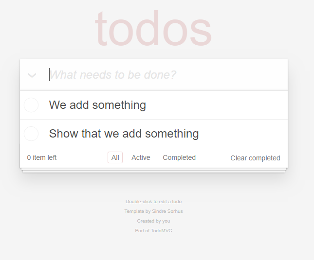

# Шаблон • [TodoMVC](http://todomvc.com)




## Как это работает

Заметки сохраняются в 3 массива

```javascript
let All = []
let Active = []
let complited = []
```

---

Массивы сохраняются в LoclaStorage


## Credit

Created by [Maximuson]()
